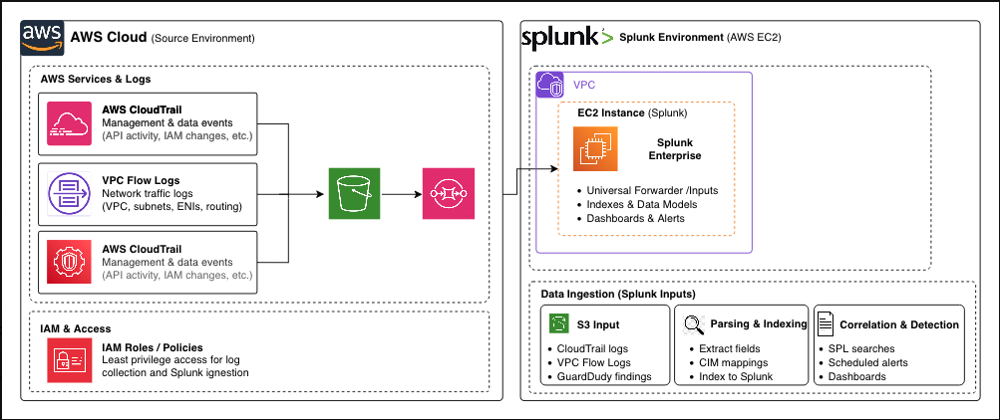

# ☁️ Cloud SIEM + Threat Detection Lab

**Goal:** Build a cloud-based SIEM using AWS + Splunk with automated detections.

🔹 **Architecture:**  

🔹 **Tools:** AWS CloudTrail, VPC Flow Logs, GuardDuty, Splunk, Kinesis, IAM

🔹 **Highlights:**  
- Automated ingestion of AWS logs into Splunk  
- Custom detections (root login, S3 public access, SSH brute-force)  
- Dashboards for real-time threat visibility  

🔹 **Resume Line:**  
*Built a cloud SIEM in AWS using Splunk to ingest CloudTrail, VPC Flow, and GuardDuty logs, creating automated detections for IAM and network anomalies.*

👉 **[See Detailed Setup](setup/aws-setup.md)** | **[View Detections](detections/)**
