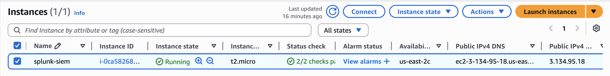

## AWS CloudTrail Setup


- Created trail named `siem-trail`
- Logs stored in S3 bucket
- Setup to only capture management logs
## AWS VPC Flow Logs Setup

- Enabled **VPC Flow Logs** for the default VPC to capture network-level traffic
- Configured to send logs to S3 bucket `aws-cloudtrail-logs-889501007400-455f2193`
- Set filter to **All** (captures both accepted and rejected traffic)
- Used **10-minute aggregation interval** for efficient batching within free-tier limits
- Will provide network connection data (source/destination IPs, ports, protocols) for SIEM ingestion and detection of events such as SSH brute-force attempts or unauthorized access patterns
## AWS GuardDuty Setup

- Enabled **Amazon GuardDuty** in region `us-east-1`
- Integrated with CloudTrail and VPC Flow Logs for continuous threat detection
- Configured with default data sources (IAM, DNS, and network activity)
- Automatically analyzes AWS logs for anomalies such as unauthorized access or reconnaissance behavior
- Provides detection insights that will later be ingested into the SIEM for correlation and alerting
## 🖥️ EC2 Instance Overview

- Launched **EC2 instance** named `Splunk-SIEM-Lab` to host the Splunk Enterprise server for the Cloud SIEM environment  
- **Purpose:** Centralized analysis engine for ingesting AWS logs (CloudTrail, GuardDuty, and VPC Flow Logs)  
- **AMI:** Ubuntu Server 22.04 LTS (x86_64)  
- **Instance Type:** t2.medium (2 vCPU, 4 GB RAM)  
- **Storage:** 20 GB EBS volume  
- **Network:** Public subnet connected to an Internet Gateway  
- **Security Group:**  
  - SSH (TCP 22) — access from **My IP**  
  - Splunk Web (TCP 8000) — access from **My IP**  
- **Key Pair:** `siem-key.pem`  
- **Connection Method:** EC2 Instance Connect (used for administrative access and Splunk configuration)  
- **Usage:** This EC2 instance serves as the main Splunk server for collecting, storing, and analyzing AWS security data, supporting correlation, detection, and visualization within the Cloud SIEM project  
## 🔑 Splunk Web Login

- Started **Splunk Enterprise** service on the EC2 instance  
- Verified operational status using:  
  ```bash
  sudo /opt/splunk/bin/splunk status
- typed 'http://localhost:8000' into my web browser to get login screen

