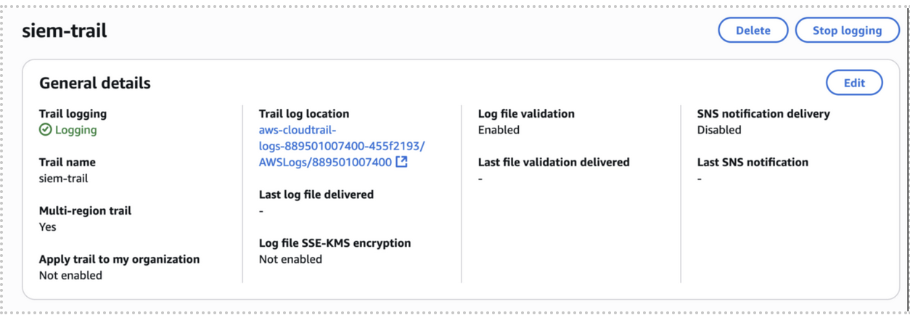
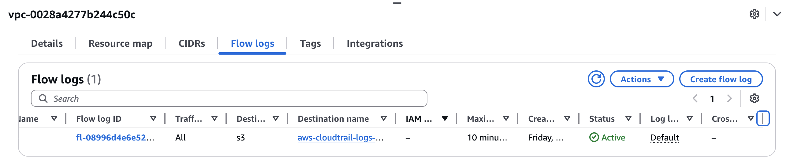
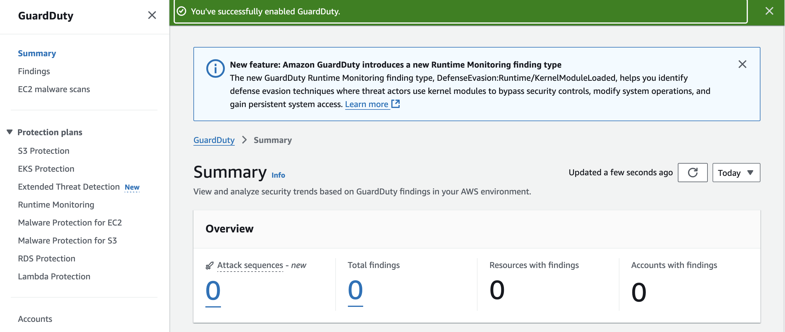

## AWS CloudTrail Setup

- Created trail named `siem-trail`
- Logs stored in S3 bucket
- Setup to only capture management logs
## AWS VPC Flow Logs Setup

- Enabled **VPC Flow Logs** for the default VPC to capture network-level traffic
- Configured to send logs to S3 bucket `aws-cloudtrail-logs-889501007400-455f2193`
- Set filter to **All** (captures both accepted and rejected traffic)
- Used **10-minute aggregation interval** for efficient batching within free-tier limits
- Will provide network connection data (source/destination IPs, ports, protocols) for SIEM ingestion and detection of events such as SSH brute-force attempts or unauthorized access patterns
## AWS GuardDuty Setup

- Enabled **Amazon GuardDuty** in region `us-east-1`
- Integrated with CloudTrail and VPC Flow Logs for continuous threat detection
- Configured with default data sources (IAM, DNS, and network activity)
- Automatically analyzes AWS logs for anomalies such as unauthorized access or reconnaissance behavior
- Provides detection insights that will later be ingested into the SIEM for correlation and alerting

