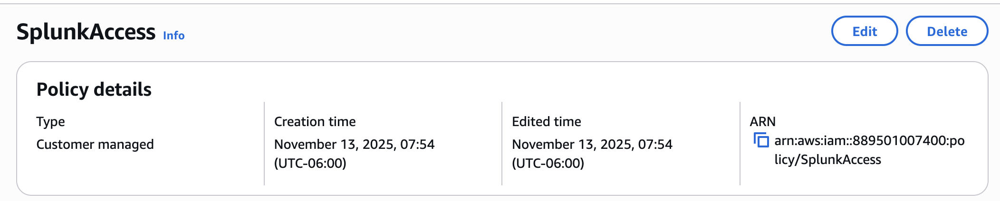
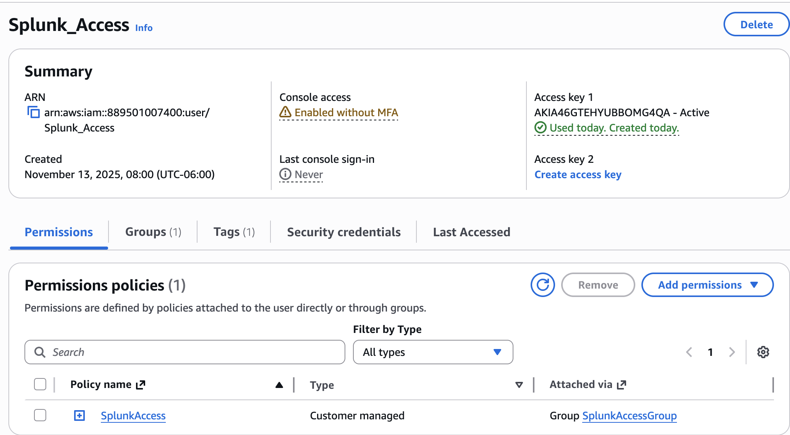
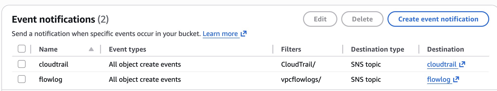
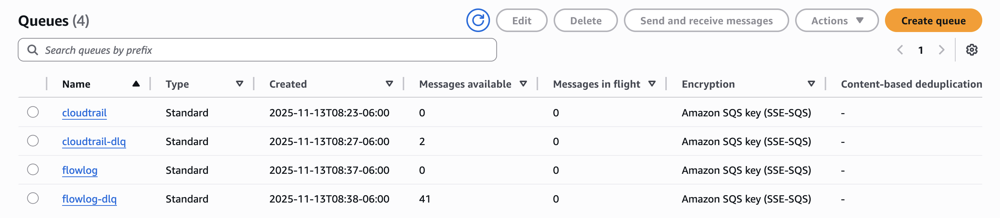
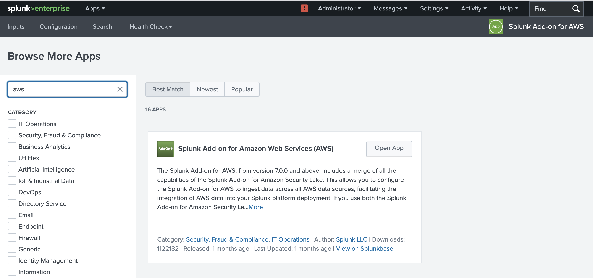
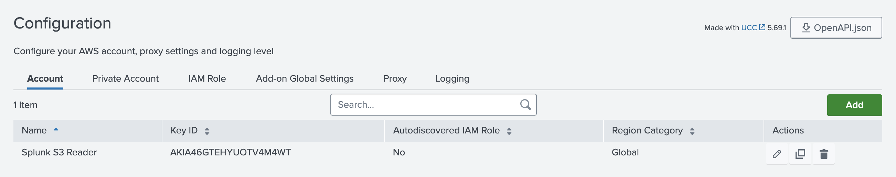
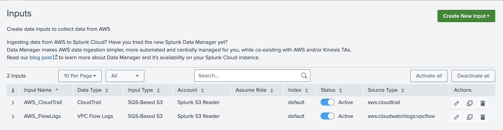

## AWS Splunk Access Policy Setup

- Created **IAM policy** named `SplunkAccess`
- Policy grants Splunk permission to read S3 and SQS data needed for CloudTrail ingestion
- Added required actions using JSON for:
  - Retrieving CloudTrail logs from the S3 bucket  
  - Receiving CloudTrail notifications from SQS
  
## AWS Splunk Access User Setup

- Created IAM user named `Splunk_Access`
- Configured user for **Programmatic access only** to provide Access Key + Secret Key for Splunk
- Added user to the **SplunkAccessGroup**
- Attached previously created **SplunkAccess** policy to the group
- Downloaded the credentials `.csv` file for later use inside the Splunk Add-on for AWS
- This user will authenticate Splunk to securely pull CloudTrail, S3, and SQS data
## AWS CloudTrail SNS Event Notification Setup

- Enabled **SNS event notifications** for the CloudTrail trail and FlowsLogs
- Configured CloudTrail to publish a notification every time a new log file is delivered to S3
- SNS Topic created to act as the event broadcaster
- **Why:** SNS sends real time alerts so services like SQS (and later Splunk) know immediately when new CloudTrail and FlowLogs are ready for ingestion
## AWS CloudTrail SQS Queue Setup

- Created **SQS queue** named `cloudtrail` and `flowlog` to receive notifications from the SNS topic
- Subscribed the queue to the CloudTrail SNS topic for automatic message delivery
- Allows Splunk to pull CloudTrail log events from SQS instead of scanning S3 directly
- **Why:** SQS provides reliable, ordered, fault tolerant message delivery that Splunk depends on to ingest CloudTrail logs without missing or duplicating events
## Splunk Add-on for AWS Installation

- Installed the **Splunk Add-on for AWS** on the Splunk instance
- Add-on provides the required inputs to collect AWS logs such as CloudTrail, VPC Flow Logs, and GuardDuty
- Allows creation of AWS accounts, SQS-based S3 inputs, and CloudWatch inputs inside Splunk
## Splunk Add-on AWS Account Configuration

- Opened the **Splunk Add-on for AWS** and navigated to the *Configuration* tab
- Added a new AWS account using the credentials from the `Splunk_Access` IAM user created in AWS
- Entered the **Access Key ID** and **Secret Access Key** from the downloaded CSV file
- Set the Region Category to **Global**
- Saved the configuration so Splunk can securely authenticate to AWS
## Splunk AWS Inputs Configuration

- Navigated to the **Inputs** tab in the Splunk Add-on for AWS
- Created a new **CloudTrail and FlowLogs SQS-Based S3 input**
- Selected the previously configured AWS account (`splunk_access`)
- Chose the correct AWS region and selected the `cloudtrail` SQS queue
- Saved the input to begin automatic ingestion of CloudTrail events and proceeded to do the same steps for FlowLogs

